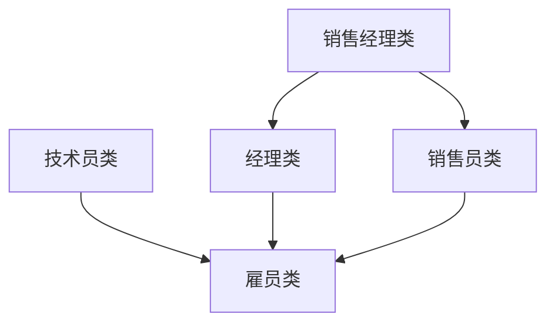

# 员工工资查询系统的设计与实现

## 设计说明与要求

### 1. 公司人员类别

公司主要有 4 类人员：

- **经理**
- **技术员**
- **销售员**
- **销售经理**

员工包含以下信息：

- 职工号
- 月工资
- 岗位
- 年龄
- 性别

---

### 2. 工资计算方法

- **经理**：固定月薪为 **8000 元**
- **技术员**：`工作时间 × 小时工资（100元/小时）`
- **销售员**：`销售额 × 4% 提成`
- **销售经理**：`底薪（5000元）+ 所辖部门销售额总额 × 0.5%`

---

### 3. 类的层次结构

---

### 4. 总体设计

系统应包含一个菜单用于选择各项功能：

1. **数据录入**：输入各种数据
2. **数据统计**：各类员工的工资计算
3. **数据打印**：打印各类员工工资
4. **退出**：退出本系统

> 注：各项菜单都应调用相应的函数来实现。

---
